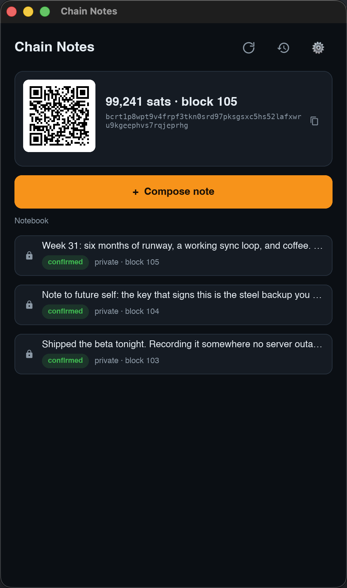
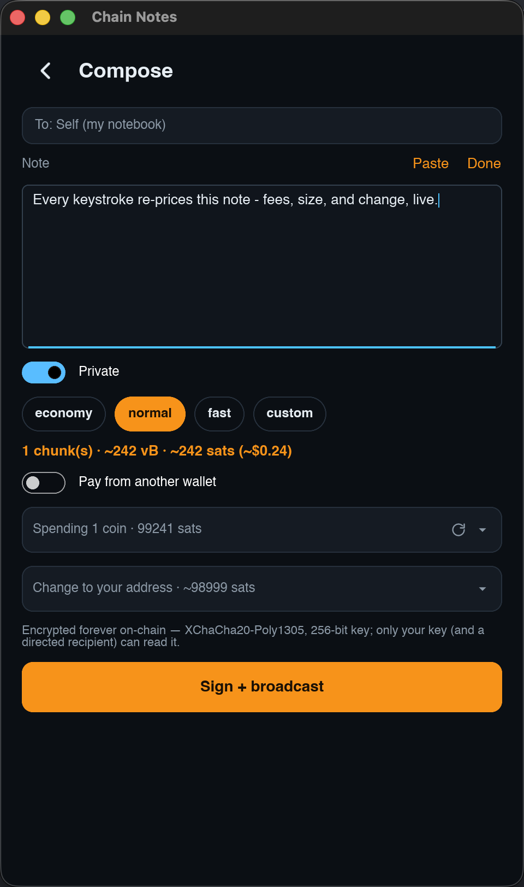
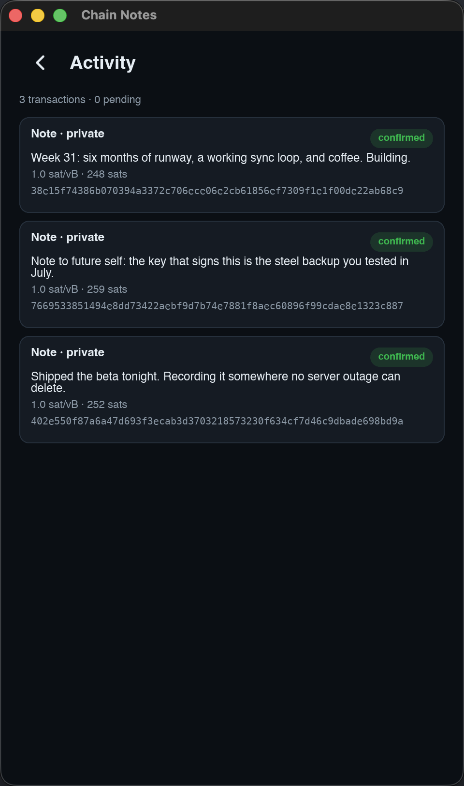

#  Chain Notes

**Bitcoin · Notes · Mac / iOS / Android** — your notebook on the bitcoin blockchain, in a native app that goes where you go.

Chain Notes writes personal notes into real bitcoin transactions — public ones anyone can read, private ones only your key can open, and directed notes delivered to any taproot address like unstoppable mail. This is the online, full-featured peer of the [Passport Prime app](https://github.com/ObjSal/prime-chain-notes): the same protocol, byte-identical transactions, but with its own keys, direct broadcasting, and a native interface on Mac, iPhone, and Android. Lose the device, keep the key — the entire notebook rebuilds itself from the chain.

<p align="center">
  
  &nbsp;
  
  &nbsp;
  
</p>

## Features

- **Your key, your way** — create a 12/24-word seed in-app with a backup-and-quiz flow, or import what you have: BIP-39 words (with autocomplete), xprv, WIF, or raw hex — typed, scanned from QR (SeedQR included), or loaded from file. Hierarchical keys get a paginated account picker, switchable anytime.
- **Keys live in the platform vault** — the macOS Keychain behind Touch ID, iOS Keychain, Android Keystore. Reveal always re-authenticates.
- **Watch-only mode** — import just an xpub or descriptor for a key-less notebook: balance and public notes visible, private bodies sealed. Everything that needs a signature — sweep, consolidate, fee bumps, even public-note compose — builds a PSBT your hardware wallet signs (verified against a real signer implementation), with an optional separate fee wallet.
- **Serious compose tools** — live cost and change preview, fee tiers plus custom rates, full **coin control** with per-coin explorer links, a custom change address, and a **gift amount** to send chosen sats along with a directed note.
- **Stay on top of your transactions** — an Activity screen with rebroadcast and RBF speed-up for stuck transactions, a Coins screen with one-tap consolidate, and a guided sweep flow.
- **Your infrastructure or theirs** — pick your Bitcoin node (mempool.space, Blockstream, or your own Esplora-compatible endpoint) and your block explorer, per network, right in Settings.
- **Every network** — mainnet, testnet4, signet, and regtest. Verified live on testnet4, including a directed private note decrypted by the Passport Prime app's own core.
- **Text editing that feels native** — right-click menus and every shortcut on the Mac; on iOS/Android an edit bubble with the platform's own trigger rules, and paste that lands exactly at the cursor.

## Compatible by construction

The app reuses the Prime app's `notes-core` as a pinned dependency — envelope, encryption, and transaction signing are the same code, so notes from either app are interchangeable on-chain. The [web viewer](https://objsal.github.io/chain-notes-companion/) renders both.

## Get it running

```bash
cargo run
```

See **[DEVELOPMENT.md](DEVELOPMENT.md)** for toolchain setup, mobile builds, and the test suites.

## Learn more

- [DEVELOPMENT.md](DEVELOPMENT.md) — building (desktop + mobile), testing, architecture pointers
- [THIRD-PARTY.md](THIRD-PARTY.md) — libraries this app is built on
- `PLAN-chain-notes-app.md` (workspace repo) — design document and milestones

## License & disclaimer

Licensed under either of the [MIT license](LICENSE-MIT) or the [Apache License 2.0](LICENSE-APACHE), at your option. Both licenses disclaim all warranty and liability; the notes below restate that in plain language.

This is experimental software and it has **not been independently audited**.
It is provided **"as is", without warranty of any kind**, express or implied,
including but not limited to the warranties of merchantability, fitness for a
particular purpose, and non-infringement.

**Use it at your own risk.** To the maximum extent permitted by law, in no
event shall the authors, copyright holders, or contributors be liable for any
claim, damages, or other liability — including, without limitation,
**loss of bitcoin or other funds, loss of keys or seeds, or loss of data** — whether in an action of contract, tort, or
otherwise, arising from, out of, or in connection with this software or its
use.

Nothing in this project is financial, investment, legal, or tax advice. You
are solely responsible for verifying addresses, amounts, fees, and backups
before moving funds, and for complying with the laws of your jurisdiction.
Test on test networks, or with amounts you can afford to lose, first.

Everything this app writes to the blockchain is **public and permanent** — including the transaction metadata around encrypted notes (addresses, timing, amounts). Notes cannot be edited or deleted once broadcast. Do not put anything on-chain you may later need gone.
